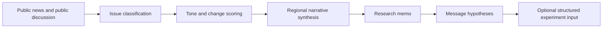

# Social Listening

**Narrative intelligence prototype for campaign research**

Social Listening turns public discourse into a strategist-ready briefing: what topics are rising, where discussion is increasing, whether coverage is mostly concerned or constructive, which stories are driving the shift, and what researchers should investigate next.

The app combines a simulated statewide discussion feed with two reproducible public-source collectors: GDELT public news and Reddit public posts. These sources are included because they are open enough for a portfolio prototype, not because they represent the full universe of voter opinion.

No private voter data is used. No voter microtargeting is performed. No persuasion effects are claimed.

## Why This Exists

Campaign research teams need a fast, explainable way to turn messy public conversation into research priorities. This prototype demonstrates that workflow:

- detect issue areas in public news and public discussion
- monitor changes in discussion volume and coverage tone
- summarize which New York regions are seeing more discussion
- identify stories that should become polling, focus group, or message-testing questions
- produce downloadable research artifacts for human review
- structure a small downstream handoff for future experimentation systems

## Architecture



## Data Sources

The sidebar includes three modes:

- **Simulated statewide discussion feed:** default mode; approximately 2,600 discussion items generated from observed New York issue and region patterns.
- **Real public news and Reddit discussion:** combines cached GDELT public news and Reddit public posts when available.
- **Real GDELT public news only:** loads only the GDELT public-news cache.

GDELT and Reddit require internet access for fresh fetches, but no API key is required for this basic demo. If either source fails, the app keeps working with the simulated statewide feed.

Real campaign systems would usually combine public news, public discussion, creator/media monitoring, polling, field notes, and campaign-owned engagement data.

## What The App Shows

- **Overview:** first-load onboarding, one dominant issue-movement chart, legend-based issue isolation, region and tone filters, and a linked story table.
- **Research memo:** concise campaign research synthesis with metadata, biggest shifts in discussion, likely concerns, message hypotheses, next research steps, and limitations.
- **Research outputs:** weekly issue brief, region watchlist, message hypothesis bank download, and polling/focus group questions.
- **For experimentation:** context features, message hypotheses, reward definitions, and an example structured experiment input for future systems.
- **About:** purpose, methodology, data sources, limitations, public/aggregate-only note, LinkedIn, and GitHub.

## Reading The Signals

- **Stories analyzed:** public stories or posts in the selected time period.
- **Change vs recent baseline:** current discussion volume compared with recent norms.
- **Attention and tone:** how much attention an issue is receiving and whether coverage is mostly positive, negative, or mixed.
- **Research priority:** a simple triage label for analyst review and message-research planning.

## Core Issue Areas

- affordability / cost of living
- housing / rent
- immigration / public safety
- AI / tech jobs
- corruption / competence / trust

## New York Regions

- NYC
- Long Island
- Hudson Valley
- Capital Region
- Central NY
- Western NY

## Output Layers

Human-readable research artifacts:

- `outputs/weekly_issue_brief.md`
- `outputs/geography_watchlist.csv`
- `outputs/message_hypothesis_bank.csv`
- `outputs/research_questions.md`
- `outputs/sample_research_memo.md`

Structured future experimentation scaffolding:

- context features
- message hypotheses
- reward definitions
- simulated experiment log
- off-policy evaluation framing as future work

## Boundaries

This is:

- a public-data social listening prototype
- a campaign research synthesis tool
- an issue and narrative monitoring demo
- a message hypothesis generator
- a lightweight portfolio project

This is not:

- a production campaign platform
- voter microtargeting
- private voter-file modeling
- a persuasion engine
- a real contextual bandit deployment
- a claim of measured persuasion effects

## How I Would Extend This In Production

- real public data ingestion at larger scale
- platform-compliant social and news APIs
- creator/media monitoring
- geographic aggregation and deduplication
- human analyst review
- randomized message tests
- off-policy evaluation
- drift monitoring
- legal/privacy review
- connection to voter-file-safe aggregate segments only if approved

## Run Locally

```bash
pip install -r requirements.txt
streamlit run app.py
```

Then open the local Streamlit URL. The default data source is **Simulated statewide discussion feed**. Switch to **Real public news and Reddit discussion** to fetch or inspect public-source caches.

## 5-Minute Demo Walkthrough

1. Start with the landing story: public discourse becomes issue movement, regional signals, research synthesis, and message hypotheses.
2. Show the Overview chart and click an issue name in the legend to isolate discussion trends.
3. Use the region and tone filters to show the chart and story table updating together.
4. Point to the linked story table as the evidence layer behind the trend.
5. Open the Research memo as the strategist-facing summary.
6. Open Research outputs and show the weekly brief, region watchlist, downloadable message hypotheses, and research questions.
7. Briefly show For experimentation as a future handoff, not the core product.
8. Close with About: public/aggregate-only, no voter microtargeting, no persuasion claims.

## Project Structure

```text
app.py
requirements.txt
README.md
.gitignore
assets/README_screenshots_placeholder.md
data/sample_articles.csv
data/sample_bandit_log.csv
data/gdelt_articles.csv
data/reddit_posts.csv
data/operational_demo_corpus.csv
src/classify_topics.py
src/scoring.py
src/generate_memo.py
src/bandit_simulator.py
src/collect_gdelt.py
src/collect_reddit.py
src/regions.py
src/synthetic_corpus.py
src/research_outputs.py
outputs/sample_research_memo.md
outputs/weekly_issue_brief.md
outputs/geography_watchlist.csv
outputs/message_hypothesis_bank.csv
outputs/research_questions.md
```
