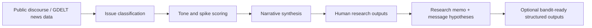

# Social Listening

**Narrative intelligence prototype for campaign research**

Social Listening is a premium narrative intelligence prototype for campaign research. It shows how public discourse can be transformed into issue movement, emerging narratives, message hypotheses, research memos, and strategist-ready research artifacts.

By default, the app uses a **synthetic operational-scale demo corpus** generated from real NY discourse patterns. Real GDELT public news remains available as a data-source toggle, and sample data is included only as a fallback/demo mode.

It also includes a small downstream **Bandit Readiness** layer showing how structured narrative signals could feed future adaptive experimentation, but no real voter targeting or persuasion optimization is performed.

## Why This Exists

Campaign research teams need a fast, explainable way to turn messy public conversation into research priorities. This prototype demonstrates that workflow without pretending to be a production platform:

- detect issue areas in public news discourse
- monitor narrative intensity and spikes
- synthesize likely concerns behind the discourse
- generate message hypotheses for human review
- produce campaign research artifacts a strategist can use immediately
- optionally structure outputs for future adaptive experimentation

No private voter data is used. No social media scraping is required. Reddit, X, and other platform-specific sources could be future extensions only if collected through compliant APIs and reviewed safeguards.

## Architecture



## Data Modes

The sidebar includes three data modes:

- **Operational-scale demo corpus:** default mode; approximately 2,600 discourse artifacts generated from observed NY issue/geography patterns.
- **Real GDELT data:** live public news from the GDELT 2.1 DOC API, no API key required.
- **Sample demo data:** offline fallback mode.

Real public news volume from GDELT is relatively sparse for narrowly constrained NY political narratives, so the operational demo corpus extrapolates realistic statewide monitoring volume from observed patterns.

For real GDELT mode:

- If `data/gdelt_articles.csv` exists, the app loads it.
- If it does not exist, click **Fetch latest GDELT articles**.
- If GDELT is unavailable, the app falls back to `data/sample_articles.csv` and shows a warning.
- Date windows support last 7, 14, or 30 days.
- Results are deduplicated by URL and title.

The collector lives in `src/collect_gdelt.py` and queries public English-language news for New York geography terms across the existing issue areas.

## What The App Shows

- **Above-the-fold briefing:** hero insight, three strategic implications, and one dominant narrative momentum visualization.
- **Overview:** issue movement, tone by issue, geography concentration, and data-quality notes.
- **Narrative Radar:** transparent keyword classification, tone scoring, narrative intensity, spike score, and `watch/test/ignore` flags.
- **Research Memo:** campaign research synthesis with what changed, likely concerns, message hypotheses, next tests, and limitations.
- **Research Outputs:** weekly issue brief, geography watchlist, message hypothesis bank, and polling/focus group questions with downloadable files.
- **Future Experimentation:** a lightweight Bandit Readiness section with context features, message arms, reward definitions, simulated experiment logs, and off-policy evaluation as future work.
- **What this is / what this is not:** clear boundaries around public data, no private voter data, no microtargeting, and no measured persuasion claims.

## Two Output Layers

The immediate value is human-readable campaign research synthesis:

- `outputs/weekly_issue_brief.md`
- `outputs/geography_watchlist.csv`
- `outputs/message_hypothesis_bank.csv`
- `outputs/research_questions.md`
- `outputs/sample_research_memo.md`

The secondary layer is machine-readable scaffolding for future experimentation:

- context features
- message arms
- reward definitions
- simulated experiment log
- off-policy evaluation framing

## Interpreting The Scores

- **Spike score:** estimated discussion volume compared with the recent baseline. A score near `3` means discussion is roughly 3x above normal.
- **Narrative intensity:** a lightweight triage score based on keyword density, urgency language, and source amplification.
- **Radar flag:** a research-priority label. `test` means move toward message hypothesis testing; `watch` means analyst monitoring; `ignore` means low current priority.

## Core Issue Areas

- affordability / cost of living
- housing / rent
- immigration / public safety
- AI / tech jobs
- corruption / competence / trust

## Bandit Readiness As A Future Extension

This project is not a contextual bandit project. The bandit-ready layer is intentionally small and downstream from the human research outputs. It exists to show how narrative intelligence outputs could later become structured experimentation inputs:

- context features
- message arms
- reward definitions
- simulated experiment log
- off-policy evaluation as future work

The included sample experiment log is simulated. It demonstrates the shape of responsible logging: timestamp, anonymized unit ID, context, message arm, propensity score, outcomes, reward, and logging policy.

## What This Is / What This Is Not

This is:

- public-data social listening prototype
- campaign research synthesis tool
- issue/narrative monitoring demo
- message hypothesis generator
- lightweight portfolio project

This is not:

- a production campaign platform
- voter microtargeting
- private voter-file modeling
- a persuasion engine
- a real contextual bandit deployment
- a claim of measured persuasion effects

## How I Would Extend This In Production

- Real public data ingestion beyond GDELT
- Platform-compliant social/news APIs
- Geographic aggregation
- Human analyst review
- Randomized message tests
- Off-policy evaluation
- Drift monitoring
- Legal/privacy review
- Connection to voter-file-safe aggregate segments only if approved

## Run Locally

```bash
pip install -r requirements.txt
streamlit run app.py
```

Then open the local Streamlit URL. The default data source is **Operational-scale demo corpus**. Switch to **Real GDELT data** in the sidebar when you want to fetch or inspect the live public-news cache.

## 5-Minute Demo Walkthrough

1. Start with the landing story: public discourse becomes issue detection, narrative monitoring, research synthesis, and message hypotheses.
2. Show the operational-scale corpus note and explain why it simulates statewide monitoring volume.
3. Show the Overview metrics and executive summary.
4. Show an issue spike and explain the `watch/test/ignore` flag.
5. Open Narrative Radar and show the transparent keyword rules, tone, intensity, and top snippets.
6. Show the generated Research Memo as a concise campaign research synthesis.
7. Open Research Outputs and show the weekly issue brief, geography watchlist, message hypothesis bank, and research questions.
8. Briefly show Bandit Readiness as a future extension: context features, message arms, rewards, simulated log, and future OPE.
9. Close with What this is / what this is not.

## Project Structure

```text
app.py
requirements.txt
README.md
.gitignore
assets/README_screenshots_placeholder.md
data/sample_articles.csv
data/sample_bandit_log.csv
data/gdelt_articles.csv
data/operational_demo_corpus.csv
src/classify_topics.py
src/scoring.py
src/generate_memo.py
src/bandit_simulator.py
src/collect_gdelt.py
src/synthetic_corpus.py
src/research_outputs.py
outputs/sample_research_memo.md
outputs/weekly_issue_brief.md
outputs/geography_watchlist.csv
outputs/message_hypothesis_bank.csv
outputs/research_questions.md
```
