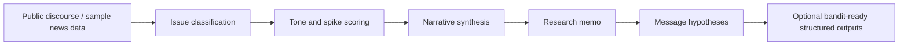

# Social Listening

**Narrative intelligence prototype for campaign research**

Social Listening is a lightweight narrative intelligence prototype for campaign research. It shows how public discourse can be transformed into issue trends, emerging narratives, message hypotheses, and research memos.

It also includes a small downstream **Bandit Readiness** layer showing how structured narrative signals could feed future adaptive experimentation, but no real voter targeting or persuasion optimization is performed.

The internal demo dashboard is called **NY Narrative Radar** because the sample data is framed around New York 2026 midterm discourse. The primary project is social listening and narrative intelligence, not contextual bandits.

## Why This Exists

Campaign research teams need a fast, explainable way to turn messy public conversation into research priorities. This prototype demonstrates that workflow without pretending to be a production platform:

- detect issue areas in public discourse
- monitor narrative intensity and spikes
- synthesize likely concerns behind the discourse
- generate message hypotheses for human review
- produce a short research memo
- optionally structure outputs for future adaptive experimentation

## Architecture



## What The App Shows

- **Overview:** executive summary, issue volume by day, issue mix, tone by issue, and top New York geographies.
- **Narrative Radar:** transparent keyword classification, tone scoring, narrative intensity, spike score, and `watch/test/ignore` flags.
- **Research Memo:** campaign research synthesis with what changed, likely concerns, message hypotheses, next tests, and limitations.
- **Future Experimentation:** a lightweight Bandit Readiness section with context features, message arms, reward definitions, simulated experiment logs, and off-policy evaluation as future work.
- **What this is / what this is not:** clear boundaries around public data, no private voter data, no microtargeting, and no measured persuasion claims.

## Core Issue Areas

- affordability / cost of living
- housing / rent
- immigration / public safety
- AI / tech jobs
- corruption / competence / trust

## Bandit Readiness As A Future Extension

This project is not a contextual bandit project. The bandit-ready layer is intentionally small and downstream. It exists to show how narrative intelligence outputs could later become structured experimentation inputs:

- context features
- message arms
- reward definitions
- simulated experiment log
- off-policy evaluation as future work

The included sample log is simulated. It demonstrates the shape of responsible logging: timestamp, anonymized unit ID, context, message arm, propensity score, outcomes, reward, and logging policy.

## What This Is / What This Is Not

This is:

- public-data social listening prototype
- campaign research synthesis tool
- issue/narrative monitoring demo
- message hypothesis generator
- lightweight portfolio project

This is not:

- a production campaign platform
- voter microtargeting
- private voter-file modeling
- a persuasion engine
- a real contextual bandit deployment
- a claim of measured persuasion effects

## What Is Simulated

Simulated:

- sample article/post dataset
- sample bandit log
- reward values
- policy simulator outputs
- message arm performance

Real:

- Streamlit dashboard
- transparent classification rules
- tone, intensity, and spike scoring pipeline
- memo generation
- context feature construction
- repo structure ready for local demo

## How I Would Extend This In Production

- Real public data ingestion
- Platform-compliant social/news APIs
- Geographic aggregation
- Human analyst review
- Randomized message tests
- Off-policy evaluation
- Drift monitoring
- Legal/privacy review
- Connection to voter-file-safe aggregate segments only if approved

## Run Locally

```bash
pip install -r requirements.txt
streamlit run app.py
```

The app runs entirely from local sample CSVs and does not require API keys or internet access.

## 5-Minute Demo Walkthrough

1. Start with the landing story: public discourse becomes issue detection, narrative monitoring, research synthesis, and message hypotheses.
2. Show the Overview metrics and executive summary.
3. Show an issue spike and explain the `watch/test/ignore` flag.
4. Open Narrative Radar and show the transparent keyword rules, tone, intensity, and top snippets.
5. Show the generated Research Memo as the campaign research output.
6. Briefly show Bandit Readiness as a future extension: context features, message arms, rewards, simulated log, and future OPE.
7. Close with What this is / what this is not.

## Project Structure

```text
app.py
requirements.txt
README.md
.gitignore
assets/README_screenshots_placeholder.md
data/sample_articles.csv
data/sample_bandit_log.csv
src/classify_topics.py
src/scoring.py
src/generate_memo.py
src/bandit_simulator.py
src/collect_gdelt.py
outputs/sample_research_memo.md
```
